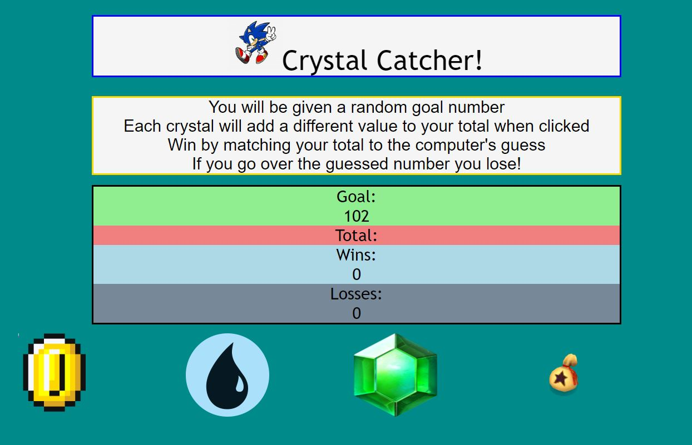

# unit4game
hw #4 jquery game
 crystal collector hw#4 for my coding bootcamp!
https://alexlo15.github.io/unit4game/

# [Crystal Catcher](https://alexlo15.github.io/unit4game/)
RU-SOM-FSF-FT-06-2019-U-C | Homework #4

___

## Motivation
Create another fun and interactive game for web browsers. This site utilizes jQuery to dynamically change the HTML.

## Technologies used and why

**Built with:**
* [jQuery](https://jquery.com/)
* [HTML]
* [CSS]
* [JavaScript]

## License
A short snippet describing the license (MIT, Apache etc)

MIT © 
[Alex Lo](https://github.com/alexlo15)

